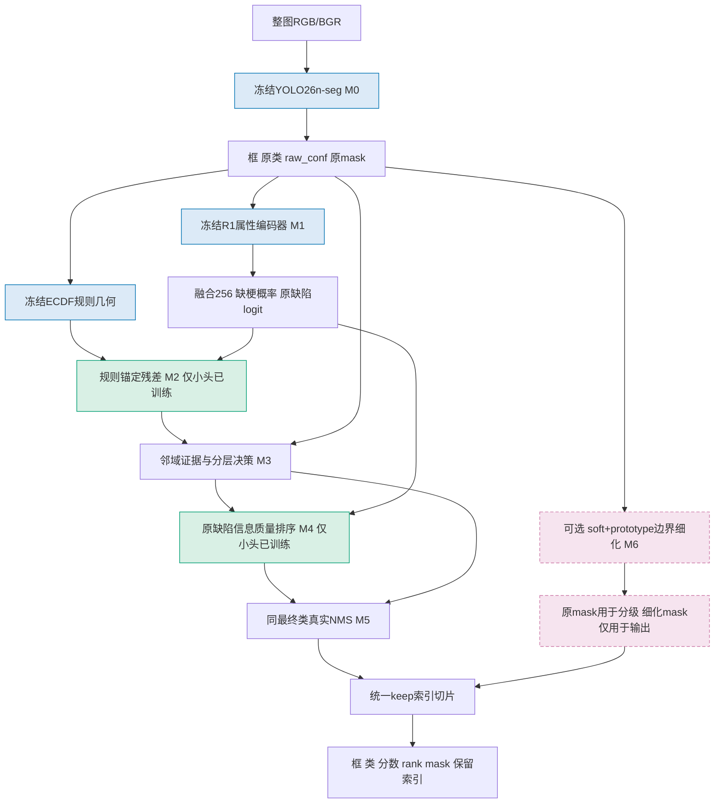
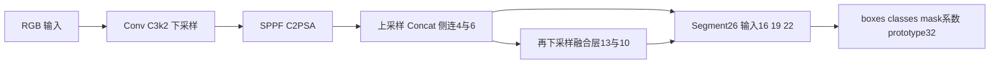
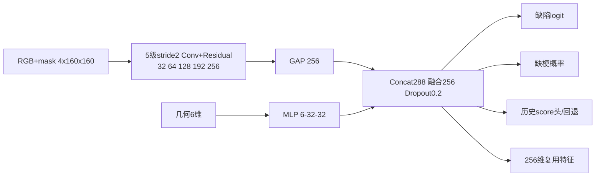
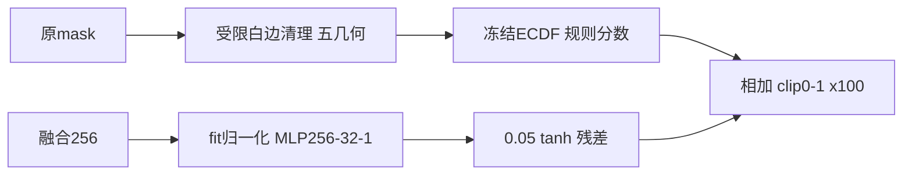
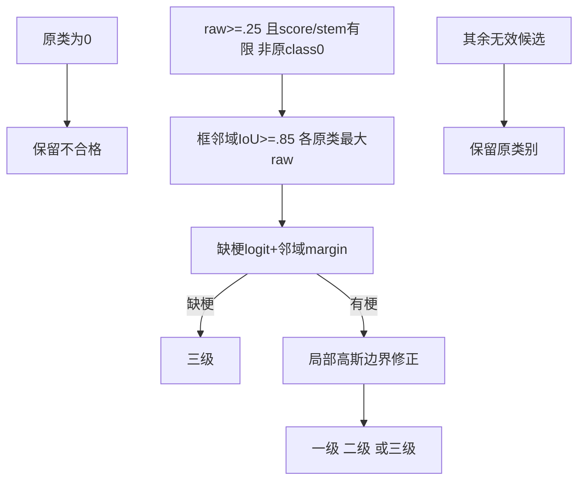
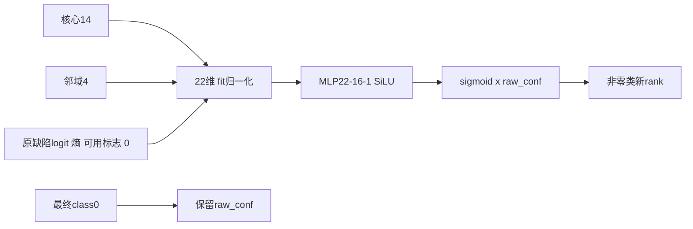
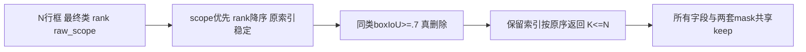
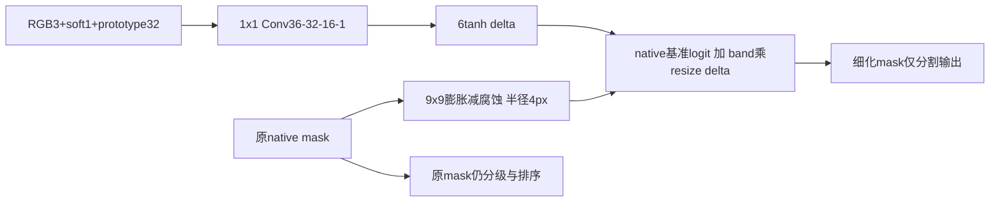
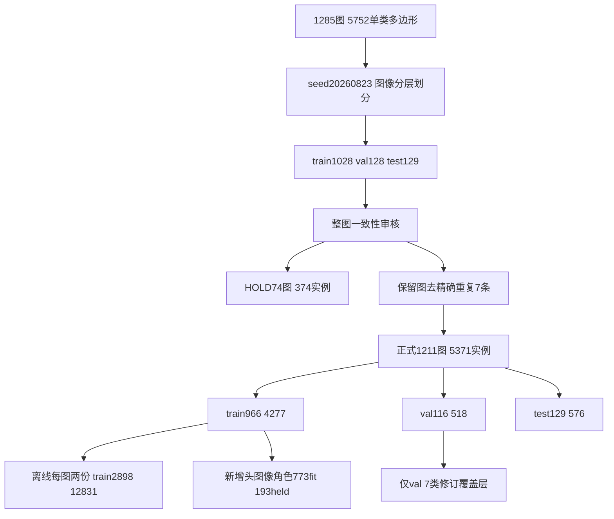

# 根据代码绘制的模块示意图

各连接以最终实现为准，非实验结果。冻结、训练小头和可选身份见M0–M6卡片；所有输入输出按原候选索引对齐。

## 系统总流程

```mermaid
flowchart TD
 I[整图RGB/BGR] --> Y[冻结YOLO26n-seg M0]
 Y --> C[框 原类 raw_conf 原mask]
 C --> R[冻结R1属性编码器 M1]
 C --> G[冻结ECDF规则几何]
 R --> F[融合256 缺梗概率 原缺陷logit]
 G --> S[规则锚定残差 M2 仅小头已训练]
 F --> S
 S --> D[邻域证据与分层决策 M3]
 C --> D
 D --> Q[原缺陷信息质量排序 M4 仅小头已训练]
 F --> Q
 Q --> N[同最终类真实NMS M5]
 D --> N
 C --> P[可选 soft+prototype边界细化 M6]
 P --> O[原mask用于分级 细化mask仅用于输出]
 N --> K[统一keep索引切片]
 O --> K
 K --> Z[框 类 分数 rank mask 保留索引]
 classDef frozen fill:#dceaf7,stroke:#0072b2;
 classDef trained fill:#d9f0e5,stroke:#009e73;
 classDef optional fill:#f6e4ef,stroke:#cc79a7,stroke-dasharray:5 3;
 class Y,R,G frozen;
 class S,Q trained;
 class P,O optional;
```

## M0_检测器结构

```mermaid
flowchart LR
 I[RGB 输入] --> B[Conv C3k2 下采样]
 B --> A[SPPF C2PSA]
 A --> U[上采样 Concat 侧连4与6]
 U --> D[再下采样融合层13与10]
 U --> H[Segment26 输入16 19 22]
 D --> H
 H --> O[boxes classes mask系数 prototype32]
```

## M1_属性编码器

```mermaid
flowchart LR
 I[RGB+mask 4x160x160] --> V[5级stride2 Conv+Residual<br/>32 64 128 192 256]
 V --> P[GAP 256]
 G[几何6维] --> M[MLP 6-32-32]
 P --> C[Concat288 融合256 Dropout0.2]
 M --> C
 C --> A[缺陷logit]
 C --> S[缺梗概率]
 C --> R[历史score头/回退]
 C --> F[256维复用特征]
```

## M2_规则残差

```mermaid
flowchart LR
 M[原mask] --> G[受限白边清理 五几何]
 G --> E[冻结ECDF 规则分数]
 F[融合256] --> N[fit归一化 MLP256-32-1]
 N --> D[0.05 tanh 残差]
 E --> S[相加 clip0-1 x100]
 D --> S
```

## M3_分层与邻域

```mermaid
flowchart TD
 B[原类为0] --> U[保留不合格]
 A[raw>=.25 且score/stem有限 非原class0] --> E[框邻域IoU>=.85 各原类最大raw]
 E --> M[缺梗logit+邻域margin]
 M -->|缺梗| G3[三级]
 M -->|有梗| T[局部高斯边界修正]
 T --> G[一级 二级 或三级]
 X[其余无效候选] --> O[保留原类别]
```

## M4_质量排序

```mermaid
flowchart LR
 A[核心14] --> C[22维 fit归一化]
 B[邻域4] --> C
 D[原缺陷logit 熵 可用标志 0] --> C
 C --> M[MLP22-16-1 SiLU]
 M --> S[sigmoid x raw_conf]
 S --> O[非零类新rank]
 U[最终class0] --> R[保留raw_conf]
```

## M5_NMS与索引

```mermaid
flowchart LR
 I[N行框 最终类 rank raw_scope] --> S[scope优先 rank降序 原索引稳定]
 S --> D[同类boxIoU>=.7 真删除]
 D --> K[保留索引按原序返回 K<=N]
 K --> O[所有字段与两套mask共享keep]
```

## M6_可选边界

```mermaid
flowchart LR
 R[RGB3+soft1+prototype32] --> H[1x1 Conv36-32-16-1]
 H --> D[6tanh delta]
 M[原native mask] --> B[9x9膨胀减腐蚀 半径4px]
 B --> A[native基准logit 加 band乘resize delta]
 D --> A
 A --> O[细化mask仅分割输出]
 M --> G[原mask仍分级与排序]
```

## 数据构建与划分

```mermaid
flowchart TD
 I[1285图 5752单类多边形] --> S[seed20260823 图像分层划分]
 S --> A[train1028 val128 test129]
 A --> Q[整图一致性审核]
 Q --> H[HOLD74图 374实例]
 Q --> D[保留图去精确重复7条]
 D --> F[正式1211图 5371实例]
 F --> T[train966 4277]
 F --> V[val116 518]
 F --> E[test129 576]
 T --> U[离线每图两份 train2898 12831]
 V --> O[仅val 7类修订覆盖层]
 T --> R[新增头图像角色773fit 193held]
```
